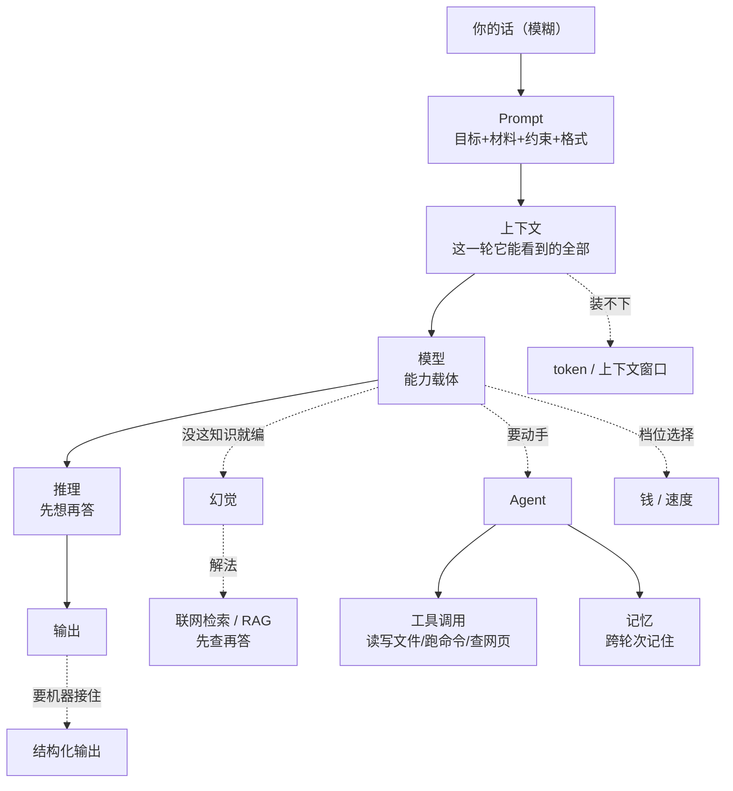

# ② AI 概念地图

> 🎯 **本区规则**：不抄百科定义。每个概念只答四问 ——
> **① 一句人话 ② 什么时候有用 ③ 最容易误解什么 ④ 可直接拿去追问 AI 的句子**

---

## 📚 按"它管什么"分四组

| 组 | 概念 | 打开 |
|---|---|---|
| **A. 决定它能不能懂你** | 上下文、token、上下文窗口、系统提示、温度 | [[20-领域/AI/AI表达翻译器/02-AI概念扫盲/A-它能不能懂你\|A 组]] |
| **B. 决定它答得准不准** | 幻觉、推理、知识截止、联网检索、RAG、引用 | [[20-领域/AI/AI表达翻译器/02-AI概念扫盲/B-它答得准不准\|B 组]] |
| **C. 决定它能不能干活** | Agent、工具调用、MCP、记忆、结构化输出、沙箱 | [[20-领域/AI/AI表达翻译器/02-AI概念扫盲/C-它能不能干活\|C 组]] |
| **D. 决定你花多少钱和多久** | 模型档位、参数量、蒸馏、量化、API、本地模型 | [[20-领域/AI/AI表达翻译器/02-AI概念扫盲/D-钱和速度\|D 组]] |

---

## 🗺 一张图看懂它们的关系



---

## ⚡ 十条能马上用上的判断

| 情况 | 大概率的原因 | 对应概念 |
|---|---|---|
| 聊久了它开始忘前面说过的 | 上下文窗口被挤满，早期内容被挤出 | [[20-领域/AI/AI表达翻译器/02-AI概念扫盲/A-它能不能懂你\|上下文窗口]] |
| 它把不存在的东西说得很确定 | 它在补齐而不是承认不知道 | [[20-领域/AI/AI表达翻译器/02-AI概念扫盲/B-它答得准不准\|幻觉]] |
| 它不知道最近发生的事 | 训练数据有截止时间 | [[20-领域/AI/AI表达翻译器/02-AI概念扫盲/B-它答得准不准\|知识截止]] |
| 数学题、多步推导常算错 | 没让它先想再答 | [[20-领域/AI/AI表达翻译器/02-AI概念扫盲/B-它答得准不准\|推理]] |
| 它说"我帮你改好了"但文件没变 | 它只是在生成文字，没有工具权限 | [[20-领域/AI/AI表达翻译器/02-AI概念扫盲/C-它能不能干活\|工具调用]] |
| 新开对话它完全不认识我 | 没有跨会话记忆，或没写进规则文件 | [[20-领域/AI/AI表达翻译器/02-AI概念扫盲/C-它能不能干活\|记忆]] |
| 输出格式每次都不一样，程序接不住 | 没要求结构化输出 | [[20-领域/AI/AI表达翻译器/02-AI概念扫盲/C-它能不能干活\|结构化输出]] |
| 同样的问题两次答得不一样 | 采样有随机性（温度） | [[20-领域/AI/AI表达翻译器/02-AI概念扫盲/A-它能不能懂你\|温度]] |
| 长文档它只看了开头 | 材料超了窗口，或被截断 | [[20-领域/AI/AI表达翻译器/02-AI概念扫盲/A-它能不能懂你\|token]] |
| 又慢又贵 | 用大模型干小活 | [[20-领域/AI/AI表达翻译器/02-AI概念扫盲/D-钱和速度\|模型档位]] |

---

## 🧠 学概念的方法（本库立场）

> 在 AI 时代，**只要你见过这个概念，你就能吃透它**——见一次问一次。所以知道的概念越多越好。
> 记不住定义没关系，能在遇到问题时想起"这大概是 ［某个概念］ 的事"，就已经够用了。

**吃透一个新词的四句追问：**

```text
① 用一句不含术语的话解释 ［概念］，并给一个日常生活的例子。
② 它解决了什么问题？没有它之前人们怎么做，为什么不够？
③ 关于它，外行最常见的三个误解是什么？
④ 在我的场景（［填你的场景］）里，它会怎么影响我的实际操作？
   如果不影响，直接说"对你没影响"，不要硬凑。
```

---

相关：[[20-领域/AI/AI表达翻译器/00-首页]] · [[20-领域/AI/AI时代的概念学习]] · [[20-领域/AI/AI时代的结构化语言认知地图]]
