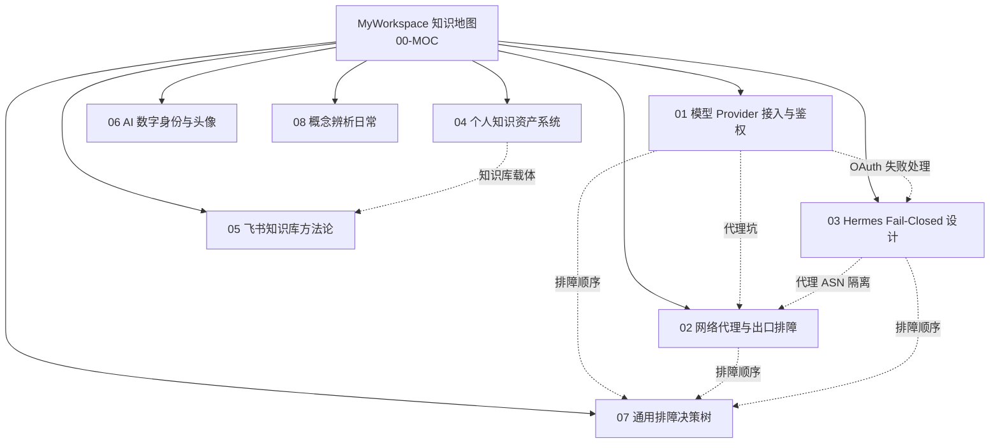

# MyWorkspace 知识地图

> 这不是文件清单，是**把 MyWorkspace 里几十个对话目录的可复用知识，按主题重新聚类而成的笔记索引**。
>
> MyWorkspace 原本按对话日期分目录（2026-07-13 到 2026-07-28），60+ 个目录里大部分是只有几行占位 README 的空壳。真正有知识价值的，是 ~15 个目录里用户自己写的诊断、设计、变更日志、实施方案。这里不再按日期镜像，而是**按知识主题抽出来重新组织**，提炼出"问题→尝试→结论→可复用教训"。

## 六篇主题笔记

### 01 — 模型 Provider 接入与鉴权
**一句话**：把 xAI Grok、Google Gemini、Antigravity 三家订阅统一接到本地 CPA 代理，再分发给 Claude/Codex/Hermes——趟出来的三个坑（代理出口与目标绑定、Antigravity 资格是服务端判的、别用网页文字判授权）和 Claude 桌面端接 Grok 的"壳名+标签覆盖+别名"三段映射。

- 关键词：OAuth、CPA、NewAPI、模型映射、Claude 3P gateway 校验
- 源目录：grok-login、grok-apple-login、claude-keep-grok-only、gemini-subscription、antigravity-login-issue、codex-model-providers 等
- → [[01-model-provider-access]]

### 02 — 网络代理与出口排障
**一句话**：国内接海外 AI 服务，代理不是"能通就行"——出口 IP 和目标是"一对多绑定"，同一出口对 A 站通对 B 站可能被 reset；做代理 A/B 前先验 ASN，否则是假实验；launchd 启动的服务不继承系统代理环境变量，要在服务自己的配置里设。

- 关键词：Shadowrocket、Clash、sing-box、ASN 隔离、Cloudflare 拦截、CPA proxy-url
- 源目录：fix-v2ex-connection、browser-access-fix、hermes-handoff、google-account-region、ip-geolocation-difference、any-router-403 等
- → [[02-network-proxy-troubleshooting]]

### 03 — Hermes 工程系统与 Fail-Closed 设计
**一句话**：接管一个 OAuth 工具时的诊断方法论与七条 fail-closed 加固规则——当外部服务端拒绝你时，本地程序该诚实地报告失败（非零退出、不重试永久拒绝、不信"成功"字样），而不是掩盖失败制造"在运行"的假象。

- 关键词：fail-closed、OAuth device flow、Access denied、grokreg、红绿循环测试
- 源目录：hermes-handoff、hermes-permissions、hermes-claude-diagnosis、hermes-model-change-failed、hermes-permission-prompts 等
- → [[03-hermes-fail-closed]]

### 04 — 个人知识资产系统设计
**一句话**：一套跨设备跨平台的私有知识保全系统，最高不变式是"来源保全层不可变且完整"——清洗稿/摘要/分类都是派生产物，永远不能代替来源；完成语义数学化 `scanned = included + excluded + blocked`；答案自带覆盖/冲突/信心边界。

- 关键词：append-only、证据包、SHA-256、数据契约、双语别名、来源保全
- 源目录：personal-knowledge-assets
- → [[04-personal-knowledge-asset-system]]

### 05 — 飞书知识库建设方法论
**一句话**：企业版"一个门户+多个领域库+受控库+项目区/归档"的四类空间，配套两级治理、页面标准、生命周期、AI 在治理之后、不用文档数当 KPI；个人版九个一级目录+五问处理流程+每周清收件箱。两版共享同一判断：**知识库的目标是被用的频率，不是页面数量**。

- 关键词：飞书知识库、领域 Owner、页面标准、权限设计、运营指标、12 周路线
- 源目录：feishu-knowledge-base-plan、feishu-cloud-storage、linux-do-feishu-document
- → [[05-feishu-knowledge-base-blueprint]]

### 06 — AI 数字身份与头像设计
**一句话**：个人在 AI 领域的数字身——"长问/元问"命名处理主体姿态与对象指向的矛盾；AGI 探索者头像表达姿态而非外貌、边际条件显式禁止清单、小尺寸可辨是硬约束；Codex 宠物小墨 v1→v2 升级加 16 朝向但**演进不改定义**。

- 关键词：长问、元问、头像设计、Codex 宠物、小墨、sprite v2
- 源目录：agi-name-ideas、agi-explorer-avatar、avatar-pet、xiao-mo-v2-upgrade、hermesagent-official-image
- → [[06-ai-identity-avatar-design]]

---

## 两篇辅助笔记

### 07 — 通用排障决策树
不管什么产品——模型不响应、应用打不开、网页连不上——同一套分层排查顺序：先分清本地 vs 上游，再分清进程 vs 配置 vs 网络。附排障的元原则（物质先于意识、矛盾分层、主要矛盾的主要方面、实践是检验标准）。
- → [[07-troubleshooting-decision-tree]]

### 08 — 概念辨析日常记录
几个只有占位 README 的概念澄清对话（model-vs-agent、model-identity、llm-wiki 等），无独立产出，一句带过，不为凑数硬包装成笔记。涉及的技术细节已在 01/02/07 各篇里以可复用形式重新组织。
- → [[08-concept-clarification-log]]

---

## 笔记之间的知识关系

## 为什么不是按日期排

原 MyWorkspace 是按对话日期建目录的，这种结构利于"回溯某天做了什么"，但不利于"再利用某类知识"。一次故障的诊断方法和另一次故障的诊断方法散在两个不同日期目录里，要复用必须记得"哪天的事"——而真正可复用的不是某天的事，是**某类问题的处理模式**。

所以这里按知识主题聚类：
- 接模型可以照着 01 抄配置和避坑
- 排代理照着 02 跑 ASN 验证和出口清单
- 接管外部失败工具照着 03 的 fail-closed 七条
- 立个人知识系统照着 04 的数据契约和完成语义
- 建飞书知识库照着 05 的四类空间和 12 周路线
- 排任何故障都可以先套 07 的决策树做分层

日期信息保存在每篇笔记的 YAML `source-dirs` 里——元信息归元信息，知识结构归知识结构，不混。

## 在 Obsidian 里怎么用

- 这套笔记都用了 frontmatter（`title`、`aliases`、`tags`、`source-dirs`、`related`），Obsidian 会自动识别
- 笔记之间用 `[[wiki]]` 双链连接，在图谱视图里能看到上面那棵关系树
- `aliases` 字段让你可以用中文名搜到这篇笔记，磁盘文件名仍合规
- 建议把这个 vault 目录整个加进 Obsidian vault列表，首页设为 [[00-MOC-myworkspace-knowledge-map]]
