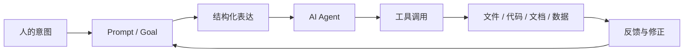

# AI 时代的结构化语言认知地图

## 核心问题

AI 时代并不是只需要“会提问”，而是更需要掌握一组能让人、机器、文件、代码、模型和协作系统共同理解的结构化表达方式。

这些表达方式包括：

- shell / bash / terminal
- Git / GitHub
- Markdown / plaintext
- JSON / YAML
- Prompt / Goal
- AI Agent

它们表面上分别属于命令行、版本管理、文档写作、数据格式和 AI 交互，但本质上都在解决同一个问题：

> 如何把人的意图、任务、知识和操作过程，变成机器可以读取、系统可以执行、他人可以协作、未来可以复用的结构。

从马克思主义实践观点看，这些工具不是孤立的“技术玩具”，而是新的生产工具和协作媒介。它们改变了知识劳动的组织方式，也改变了人和机器、人和人之间的分工关系。

## 1. shell / bash / terminal：操作系统的实践入口

### 它是什么

terminal 是人与操作系统对话的入口，shell 是解释命令的环境，bash / zsh 是常见的 shell 类型。

它们让人用文本命令直接操作文件、程序、网络、权限和系统环境。

### 它解决什么问题

- 快速查看、移动、复制、删除文件
- 启动程序、安装依赖、运行脚本
- 批量处理重复任务
- 把多个工具串联成自动化流程

### 关键理解

图形界面更适合直观操作，命令行更适合精确、重复、自动化和可记录的操作。

命令行的价值不只是“更高级”，而是它把人的操作过程变成了可以保存、复制、修改和再次执行的文本。

### 常见命令

```bash
pwd       # 查看当前位置
ls        # 列出文件
cd        # 切换目录
mkdir     # 创建文件夹
cp        # 复制
mv        # 移动或重命名
rm        # 删除
cat       # 查看文件内容
grep/rg   # 搜索文本
```

## 2. Git / GitHub：知识劳动的版本关系

### Git 是什么

Git 是版本控制系统，用来记录文件的变化历史。

它关心的不是单个文件，而是一个项目在时间中的变化过程。

### GitHub 是什么

GitHub 是基于 Git 的远程协作平台，用来托管代码、文档、Issue、PR、讨论和项目协作。

### 它解决什么问题

- 记录每一次修改
- 回到过去的版本
- 比较不同版本的差异
- 多人并行协作
- 审查、合并和发布成果

### 关键理解

Git 把“劳动过程”对象化了。一个项目不再只是最终产物，而是包含了修改、分支、冲突、讨论和合并的历史。

这很适合理解现代知识生产：成果不是一次性写成的，而是在矛盾、反馈和修正中生成的。

### 常见概念

- repository：仓库，一个项目的版本历史
- commit：一次有意义的修改记录
- branch：分支，用来并行探索不同方案
- merge：合并，把分支成果整合回来
- pull request：请求他人审查并合并修改
- issue：问题、需求或讨论记录

## 3. Markdown / plaintext：可读又可处理的知识形式

### Markdown 是什么

Markdown 是一种轻量标记语言，用普通文本表达标题、列表、引用、链接、代码块和表格。

### 它解决什么问题

- 人可以直接阅读
- 机器可以稳定解析
- 容易放进 Git 管理
- 适合知识库、README、博客、文档和笔记

### 关键理解

Markdown 的力量在于低门槛和高迁移性。它不像复杂文档格式那样被某个软件深度绑定，而是接近知识表达的“通用中间层”。

Obsidian 的核心也建立在 Markdown 和本地文件之上，这使笔记既是个人知识，也是可以迁移、检索和自动化处理的数据。

### 常见语法

```markdown
# 一级标题
## 二级标题

- 列表项
- 列表项

**加粗**
`行内代码`

[[内部链接]]
[外部链接](https://example.com)
```

## 4. JSON / YAML：让机器理解结构

### JSON 是什么

JSON 是一种数据交换格式，常用于 API、配置、数据库记录和程序之间传递信息。

```json
{
  "task": "summarize",
  "language": "zh",
  "format": "markdown"
}
```

### YAML 是什么

YAML 是一种更接近人类书写习惯的配置格式，常用于配置文件、Obsidian frontmatter、自动化流程和部署脚本。

```yaml
task: summarize
language: zh
format: markdown
```

### 它们解决什么问题

- 把零散信息组织成字段
- 让程序稳定读取和生成
- 让配置、任务和数据可以被复用
- 让 AI 输出更容易被系统接住

### 关键理解

Markdown 偏向“人读”，JSON / YAML 偏向“机器读”。AI 时代的一个重要能力，是在两者之间转换：

- 把复杂想法整理成 Markdown
- 把任务要求整理成 JSON / YAML
- 把机器输出再转成人能理解的文档

## 5. Prompt / Goal：把意图变成可执行任务

### Prompt 是什么

Prompt 是给 AI 的输入，不只是一个问题，而是对目标、背景、约束、材料、步骤和输出格式的组织。

### Goal 是什么

Goal 是任务目标。好的 Goal 应该说明“要完成什么”，而不只是“聊什么”。

### Prompt 的常见结构

```markdown
目标：
背景：
输入材料：
约束条件：
执行步骤：
输出格式：
评价标准：
```

### 关键理解

Prompt 的本质是把人的模糊意图转化为可执行的任务结构。

只会问“帮我写一下”的人，得到的是随机性较高的结果。能说明目标、材料、约束和评价标准的人，实际上已经在参与任务设计和生产过程组织。

## 6. AI Agent：从回答问题到执行流程

### AI Agent 是什么

AI Agent 不只是聊天模型，而是能够围绕目标进行规划、调用工具、读取文件、修改文件、运行命令、检查结果并持续迭代的系统。

### 它通常包含什么

- 模型：理解、推理和生成
- 工具：文件、终端、浏览器、API、数据库等
- 记忆：保存上下文和长期偏好
- 计划：拆解任务和安排步骤
- 反馈：根据结果修正行动

### 关键理解

传统 AI 更像“问答机器”，Agent 更像“任务执行者”。它把语言、工具和环境连接起来，使自然语言开始具备操作现实系统的能力。

但 Agent 并不会自动保证正确。它仍然需要人提供目标、判断标准、边界条件和结果验收。

## 7. AI 时代的“结构化语言”

这里的“结构化语言”不是单指某一种编程语言，而是一组能连接人类意图和机器行动的表达方式。

### 三个层次

1. 人类可读：Markdown、自然语言、笔记、说明文档
2. 机器可读：JSON、YAML、命令、配置文件
3. 系统可执行：shell、脚本、Git 流程、Agent 工具调用

### 一个基本链条



### 关键理解

AI 时代的核心能力之一，是把“我想要”变成一套稳定的表达、操作和反馈系统。

这不是单纯的语言能力，也不是单纯的技术能力，而是组织实践的能力。

## 8. 它们之间的整体关系

可以把这些工具理解成一个分工体系：

| 层次 | 工具 | 主要作用 |
|---|---|---|
| 操作层 | shell / terminal | 操作系统和文件 |
| 版本层 | Git / GitHub | 管理变化、协作和历史 |
| 文档层 | Markdown / plaintext | 表达知识和说明 |
| 数据层 | JSON / YAML | 表达结构化信息 |
| 任务层 | Prompt / Goal | 组织意图和目标 |
| 执行层 | AI Agent | 调用工具并完成流程 |

它们不是彼此替代，而是互相嵌套：

- Markdown 可以写 Prompt
- YAML 可以写元数据和配置
- JSON 可以作为 API 和 Agent 的输入输出
- shell 可以执行具体操作
- Git 可以记录所有变化
- GitHub 可以把个人劳动放进协作网络
- Agent 可以把这些工具串联起来

## 9. 从实践角度理解学习顺序

不需要一开始就把所有概念学完。更合理的方式是围绕真实任务逐步掌握。

### 第一阶段：能找到和修改文件

- terminal 基础
- 文件路径
- Markdown 写作
- Obsidian 笔记组织

### 第二阶段：能记录和回溯变化

- Git 基础
- commit
- diff
- branch
- GitHub 远程仓库

### 第三阶段：能组织结构化任务

- JSON / YAML
- Prompt 模板
- 项目说明文档
- 可复用工作流

### 第四阶段：能与 Agent 协同完成任务

- 明确 Goal
- 提供上下文
- 设定验收标准
- 让 Agent 执行、检查、修正
- 用 Git 记录整个过程

## 10. 用马克思主义哲学看这组工具

### 生产力角度

这些工具提高的是知识劳动的生产力。它们让写作、编程、检索、协作、自动化和复盘变得更快、更可重复。

AI Agent 进一步把部分脑力劳动流程工具化，使“提出问题、组织材料、生成草稿、修改文件、运行测试”这些环节被重新组合。

### 生产关系角度

工具改变生产力，也会改变协作关系。

GitHub、开源社区、平台 API、模型服务和自动化工具，让个人劳动更容易进入大型协作网络。但同时，平台、模型和数据的控制权也会形成新的依赖关系。

所以学习这些工具，不只是为了提高效率，也是为了理解自己在数字劳动体系中的位置。

### 矛盾分析

AI 时代至少有几组矛盾：

- 自然语言的模糊性和机器执行的精确性之间的矛盾
- 个体创造力和平台工具控制之间的矛盾
- 自动化效率和结果可靠性之间的矛盾
- 开放协作和知识产权、数据垄断之间的矛盾
- 学习门槛降低和深层理解不足之间的矛盾

真正的能力不是站在某一边喊口号，而是在具体任务中识别主要矛盾，决定什么时候需要结构化，什么时候需要人工判断，什么时候需要工具执行，什么时候必须回到现实材料检验。

### 实践观点

这些概念不能只靠背定义掌握。最有效的学习方式是：

1. 用 Markdown 写真实笔记
2. 用 Git 保存真实修改
3. 用 terminal 处理真实文件
4. 用 JSON / YAML 描述真实数据或配置
5. 用 Prompt 指挥 AI 完成真实任务
6. 用结果检验 Prompt 和流程是否有效

知识不是先完整存在于头脑里，再应用到世界中；知识是在实践、反馈和修正中逐渐成形的。

## 11. 一句话总结

shell、Git、Markdown、JSON、YAML、Prompt 和 AI Agent 共同构成了 AI 时代知识劳动的基础工具链。

它们的共同逻辑是：

> 把人的意图结构化，把结构化内容交给系统执行，再通过反馈把结果纳入新的实践循环。

掌握它们，不只是学会几个工具，而是学会在数字生产条件下组织自己的思考、劳动和协作。

## 相关笔记

- [[编程基础知识]]
- [[Claude code]]
- [[API]]
- [[AI时代的概念学习]]
- [[文献重命名工具命令]]
