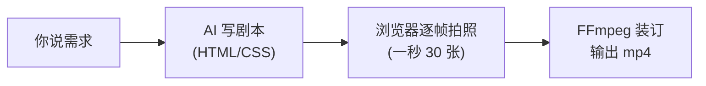

# AI剪辑方案框架：AI 剪辑的两条技术路线

> [!info] 位置
> 【启程必看】从这里开始 › 【正课阶段 3】上手智能体：桌面端与AI编程 › 第十一章：CodeX实战案例

<figure view-type="Preview"><source mime="video/mp4" origin-height="2160.000000" origin-width="3840.000000" token="UUDRbIs3aoCuLgx5YU0c1vMxn5b"/></figure>

# 写在前面

你好，我是大圣

这篇教程是 AI 剪辑的第二篇

这篇教程不是一个具体的软件的介绍，它是一整张技术地图的介绍

这篇教程我会给大家讲明白：

1. AI 剪辑拆到底层，其实只有两条技术路线：**剪的问题** 和 **画的问题**
2. 什么叫程序化视频生成框架（**「画」这条路线的主流方案，也是现在 AI 剪辑的主角**）
3. 市面上有哪些主流的工具，它们各自能做什么、不能做什么

# 一、AI 剪辑到底在解决什么问题

现在 AI 剪辑非常火，各种技术框架、各种产品，让人眼花缭乱

但把它们全部拆到底层，解决的其实只有两个问题：

- **剪的问题**：素材拍完了，哪些留、哪些删？（气口、重复、废话）
- **画的问题**：画面上长什么样？（字幕、花字、贴图、片头片尾，甚至整条画面从零生成）

上节课我们讲到的这个开拍 APP，它把这两个问题打包成了一个按钮：

- 「AI 自动识别气口一键删除」：它在帮你解决**剪的问题**
- 「网感模板、音乐字幕特效自动生成」：它在帮你解决**画的问题**

开拍的好处是简单，代价是不可定制：模板长什么样，你的视频就长什么样

这节课，我们看看里面的两条技术路线分别是怎么运转的

这节课学完之后，我希望你遇到任何的 AI 剪辑产品，都能够看懂它的底层逻辑

# 二、路线一：文本驱动剪辑（剪的问题）

我日常做自媒体，有一类形式是口播视频，我会让 AI 帮我去剪气口、重复和废话

这条路线的核心认知就一句话：**把视频当文档来剪**

假设我有一个 5 分钟的口播视频，我想让 AI 帮我剪辑，它会走三步

## 第一步：听懂（ASR）

ASR 就是语音识别：把视频里你说的话，转成一篇文字稿

**转出来的每个字都带着「时间戳」，也就是这个字出现在视频的第几分几秒**

用人话来讲：**AI 先把你的视频「听」成一篇文章，而且知道每句话对应视频里的哪一段**

## 第二步：判断（AI 读稿划线）

接下来，大模型拿着这篇文字稿开始划线：

- 这里停顿了三秒（气口）：删除
- 这句话说了两遍：保留最流畅的那一遍
- 这一段跑题了：删除

这个工作 AI 是比较擅长的，因为它善于去理解语义

## 第三步：切割（照单执行）

因为每个字都带时间戳，所以「删掉文稿里的这句话」，就等于「剪掉视频里对应的这一段」

程序按 AI 划掉的时间点，把素材切开、丢掉废片、重新拼上，一条干净的成片就出来了

<callout emoji="💡">
所以在文本驱动剪辑里：**删一句话 = 删一段视频**
不用碰时间线，改文稿就是改视频
</callout>

**所以“开拍”的一键删气口这个功能，本质就是把视频当文档来剪**

**这条路线的边界也很清楚：它只做减法：只删、不加。字幕、特效、包装，它一概不管**

# 三、路线二：程序化视频生成（画的问题）

给视频做包装或者从 0 到 1 生成视频，它比剪辑要复杂得多

这也是现在 AI 剪辑很火的一个原因，它看起来更花哨

<callout emoji="✨">
其实我自己几乎不用这种方式
**因为对我而言，简单和直接是最高级的美，我所有的精力都花在内容的逻辑上**
</callout>

平时我们剪辑视频的时候，大概率是这样：打开剪映，导入素材，在时间线上拖拖拽拽，切一刀，对齐，加字幕，放素材；

一条 3 分钟的视频，剪 2 个小时很正常

这叫**手工剪辑，**每一个操作，都要你亲手做

而这条路线主打的就是：你对 AI 说一句话，它帮你把视频包装好，或者从 0 到 1 生成一个视频

中间没有时间线，没有拖拽，你甚至没打开过任何剪辑软件

这背后的技术方案，就是这条路线的主角：**程序化视频生成框架**

这个概念会比文本驱动剪辑复杂一些，所以接下来我们核心把这个概念讲明白

<figure view-type="Preview"><source mime="video/mp4" token="MDSbbRNgJobmMxxOeuocxU4InrN"/></figure>

# 四、地基认知：视频的本质是什么

为了搞清楚程序化视频生成框架，我们首先要理解：**视频的本质，是图片的连续播放**

小时候你可能玩过翻页小人书：每一页画一个小人，姿势差一点点，快速翻动，小人就「动」起来了

视频就是这个原理。你看的每一条视频，其实是每秒 30 张图片在快速「翻页」。

一条 1 分钟的视频，就是 1800 张图片 + 声音

这个认知一建立，「程序生成视频」就不神秘了：

**只要程序能画出每一张图，它就能造出整条视频**

那么问题来了：程序怎么画图？谁来画？画完了谁来装订成视频？这就是接下来的流水线

# 五、流水线上的三个角色

一条程序化生成的视频，从无到有要经过三个步骤

每个步骤都会出现一些新的概念，你可能都没有听说过

但不要慌，你不需要了解它底层的技术细节，你只要知道有这么个概念，它做的是什么事情即可

<figure view-type="Preview"><source mime="video/mp4" origin-height="2160.000000" origin-width="3840.000000" token="YK5Nbv6AkoEJl3xaMpecNFMwnRg"/></figure>

<figure view-type="Preview"><source mime="video/mp4" token="QFNyb4S5Goztm4x60nvcwXWNnJm"/></figure>

## 角色一：剧本生成 -- HTML 和 CSS

HTML 和 CSS，是一种画面描述语言，它们原本是用来写网页的

你每天看的所有网页：淘宝、知乎、包括这篇教程，本质上都是一堆文字描述：

这里放一个标题，字号 40，红色；下面放一张图，居中

然后浏览器读了这些描述，把画面画给你看

PS：如果你想深入学习这两个概念，请自行谷歌或者用 AI 讲给你听

程序化视频框架干的事，就是把这套描述网页的语言，拿来描述视频画面：

> 第 1 秒，屏幕中间出现产品图；第 2 秒，标题从左边飞入；第 3 秒……

所以在这条流水线上，HTML/CSS 承担的角色是**剧本**：把每个时刻画面上有什么、在哪、怎么动，全部写成文字

## 角色二：摄影师 -- 浏览器

浏览器就是我们每天上网用的 Chrome、Edge

它有一个能力：把画面描述变成真实画面。你打开任何网页，都是它在干这个活

程序化视频框架就利用了这个本事：让浏览器把剧本「演」出来，然后每一帧都拍一张照，一秒拍 30 张

一条 1 分钟的视频，浏览器咔咔咔拍 1800 张图，所以浏览器的角色是**摄影师**：照着剧本，逐帧拍照

## 角色三：装订工 -- FFmpeg

现在你手里有 1800 张图片和一条音频，但它们还不是视频

把它们合成一个 mp4 文件的工具，叫 FFmpeg

FFmpeg 是视频处理领域的一个开源工具，已经存在 20 多年了

你用过的几乎所有视频软件：剪映、格式工厂、各种转码压缩工具，底层都有它的影子

它的角色是**装订工**：把成千上万张图片和音频，按顺序装订、压缩，输出一个标准的视频文件

## 三个角色拼起来

| 工位 | 名词 | 人话翻译 | 它承担的作用 |
|-|-|-|-|
| 剧本 | HTML / CSS | 画面描述语言，本来是写网页的 | 描述每个时刻画面上有什么、在哪、怎么动 |
| 摄影师 | 浏览器（Chrome） | 你每天上网用的那个东西 | 把描述「演」出来，逐帧拍照，一秒 30 张 |
| 装订工 | FFmpeg | 视频界的瑞士军刀，几乎所有视频软件底层都有它 | 把几千张图片 + 音频装订成一个 mp4 |

# 六、为什么这条路线成了 AI 剪辑的主流

**AI 友好（最核心的一条）**

**程序化视频方案把做视频变成了写文字**

你让 AI 写一段文字描述：**标题从左边飞入，停留 2 秒**

这正是大模型最擅长的事

这就是为什么所谓的AI 剪辑，底层大多是这套方案

**PS：还有一些其他的优势，但我觉得都不是核心，就不在这里讲了**

# 七、路线二的主流工具

截止到 2026 年的 7 月 28 号，目前路线二有两个主流的工具

一个是老大哥：Remotion

一个是新贵：HyperFrames

## Remotion：程序员的标杆

2020 年诞生，是这个领域的开创者和事实标准

它的出身是需要会写代码（React，一种前端编程技术），所以原来用户主要是程序员。它的生态最成熟、资料最多、坑最少

要注意的是它不完全免费：公司到了一定规模，商用需要付费

## HyperFrames：为 AI 而生的新秀

2026 年才开源，出品方是 HeyGen（做 AI 数字人的公司）

它最大的特点是：一出生就是设计给 AI 用的——你不用会写代码，AI 替你写，它负责生成视频。完全开源免费

---

## 结论

<callout emoji="✨">
随着 Remotion 的发展以及 AI 技术的发展
Remotion 也提出了一个口号：专门为 Agent 而生的视频工具
但不论是哪种框架，我们作为普通创作者，都是通过 AI 间接使用：我们说出需求，AI 去操作工具
----
所以没有必要去刻意对比两者的优缺点。一般来说，我们都会用新的 HyperFrames
如果你对 Remotion 感兴趣，也可以借助 AI 去使用。现在有各种 AI 工具，使用这类产品技术门槛极低
</callout>

# 八、从开源框架到产品：ChatCut

讲到这里你可能发现了：前面提到的东西：

Remotion、HyperFrames、FFmpeg全都是开源的

开源意味着免费、自由，但它们本质上是零件，有零件的地方，就一定有人造整车

**ChatCut 就是这样一款AI剪辑产品**：一个网页版的 AI 剪辑器，你用说话的方式指挥它

- 把这段口播里的废话删掉
- 加一段章节动画

拆开看，它装的正是我们这节课讲的两条路线：

- 文字稿即时间轴，改文稿 = 改视频：这是**剪的路线**（文本驱动剪辑）
- AI 动效、字幕、图表动画：这是**画的路线**（程序化包装）
- **它还更进一步：缺素材时能帮你生成 B-roll、配图、配乐**

它和开源框架的区别，不在技术，在形态：

底层跑的还是同一条流水线（听懂、切割、包装、渲染），但产品把整条流水线封装了起来——你不用搭环境、不用碰代码、出了问题有人兜底。

它还提供 Claude Code、Codex 这类 AI 编程助手的插件：你在 AI 对话框里就能直接指挥它剪辑

这也再次印证了前面的判断：AI 剪辑的入口，正在变成对话

当然，产品不免费：ChatCut 有免费额度，正式使用是按月订阅（25 美元/月起）

# 九、AI 剪辑的边界

AI 剪辑不是无所不能，这里面本质还是 AI 的底层原理

**AI 剪辑能接管的：**

- 删气口、删重复、按文稿粗剪（剪的路线）
- 字幕、花字、贴图、片头片尾（画的路线：包装）
- 数据图表动画（涨跌曲线、排行榜）
- 模板化的批量视频（产品介绍、拜年祝福、房源展示）
- 信息密度高、画面规则性强的内容

**AI 剪辑接管不了的：**

**纪录片、访谈里哪个镜头动人、在哪里留白，这是创作判断，不是删气口那种机械判断**

<callout emoji="✨">
你可以认为 AI 现在最擅长处理的是文字，但关于图片的识别能力还没有那么强
所以如果你想让他判断这个画面是不是够动人，他还不能做到很好
</callout>
